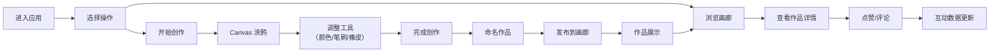

## 1. 产品概述

简笔画涂鸦画廊是一个面向创意爱好者的在线涂鸦社区平台。用户可以在 Canvas 画布上自由创作简笔画，完成后将作品发布到公共画廊，与其他用户分享创意。平台支持作品浏览、点赞、评论等社交互动功能，让涂鸦创作变得更有趣。

- 主要目的：提供一个简单易用的在线涂鸦工具，同时构建一个分享和交流创意的社区平台
- 目标用户：喜欢简笔画、涂鸦创作的所有年龄段用户
- 产品价值：降低创作门槛，让每个人都能轻松表达创意，发现和欣赏他人作品

## 2. 核心功能

### 2.1 用户角色
| 角色 | 注册方式 | 核心权限 |
|------|----------|----------|
| 普通用户 | 无需注册，自动分配访客身份 | 创作涂鸦、发布作品、浏览画廊、点赞、评论 |

### 2.2 功能模块
1. **涂鸦创作页**：Canvas 画布、调色盘、笔刷粗细调节、橡皮擦、清空画布、撤销操作
2. **公共画廊页**：作品列表网格展示、热门/最新排序、作品缩略图预览
3. **作品详情页**：大图展示、作品信息、点赞按钮、评论列表、发表评论
4. **发布弹窗**：作品命名、确认发布

### 2.3 页面详情
| 页面名称 | 模块名称 | 功能描述 |
|---------|----------|----------|
| 涂鸦创作页 | 画布区域 | 全屏 Canvas 画布，支持鼠标/触摸绘画 |
| 涂鸦创作页 | 工具栏 | 调色盘（12 种预设颜色 + 自定义取色器）、笔刷粗细滑块、橡皮擦切换、撤销按钮、清空按钮 |
| 涂鸦创作页 | 发布按钮 | 点击后弹出命名弹窗，确认后发布到画廊 |
| 公共画廊页 | 顶部导航 | Logo、创建按钮、排序切换（热门/最新） |
| 公共画廊页 | 作品网格 | 响应式卡片布局，展示作品缩略图、标题、作者、点赞数 |
| 作品详情页 | 作品展示 | 居中展示完整作品图片、标题、作者昵称、发布时间 |
| 作品详情页 | 互动区域 | 点赞按钮（带动画）、评论输入框、评论列表 |

## 3. 核心流程

用户进入首页后，可以选择直接开始创作，或者先浏览公共画廊。创作完成后为作品命名并发布，作品会出现在画廊中供其他用户浏览和互动。

## 4. 用户界面设计

### 4.1 设计风格
- **整体风格**：童趣手绘风（Playful & Toy-like），温暖明亮，富有创造力
- **主色调**：阳光黄 `#FFD93D`、珊瑚粉 `#FF6B6B`、天空蓝 `#4ECDC4`
- **辅助色**：薄荷绿 `#95E1D3`、薰衣草紫 `#D6A2E8`、蜜桃橙 `#F8B739`
- **中性色**：米白背景 `#FFFBEB`、深灰文字 `#2D3436`、浅灰边框 `#E8E8E8`
- **按钮风格**：圆润饱满（圆角 16px），带轻微阴影和弹跳动画
- **字体**：标题使用圆润可爱的 `ZCOOL KuaiLe`，正文使用清晰的 `Noto Sans SC`
- **布局风格**：卡片式布局，柔和阴影，大量留白，元素间有呼吸感
- **图标**：使用手绘风格的 Lucide 图标，线条圆润
- **装饰元素**：简笔画风格的小装饰（星星、爱心、涂鸦线条）作为背景点缀

### 4.2 页面设计概述
| 页面名称 | 模块名称 | UI 元素 |
|---------|----------|---------|
| 涂鸦创作页 | 画布区域 | 白色画布，带纸张纹理背景，居中放置 |
| 涂鸦创作页 | 工具栏 | 底部固定工具栏，渐变色背景，工具按钮带悬停放大效果 |
| 涂鸦创作页 | 调色盘 | 圆形色板排列，选中时有弹跳缩放动画 |
| 公共画廊页 | 作品网格 | 瀑布流卡片布局，卡片悬停时轻微上浮并显示阴影 |
| 公共画廊页 | 排序切换 | 胶囊状切换按钮，选中项有背景色填充动画 |
| 作品详情页 | 作品展示 | 圆角边框，柔和阴影，图片加载时有渐显动画 |
| 作品详情页 | 点赞按钮 | 心形图标，点击时有缩放和粒子喷发动画 |
| 作品详情页 | 评论区 | 气泡式评论卡片，新评论从下向上滑入 |

### 4.3 响应式
- **桌面端优先**：以 1440px 宽度为基准设计
- **平板适配**：768px 断点，工具栏改为侧边布局，画廊网格调整为 2-3 列
- **移动端适配**：375px 断点，画布自适应屏幕宽度，工具栏改为底部紧凑布局，画廊单列展示
- **触摸优化**：所有可点击区域最小 44x44px，支持触摸滑动和多点触控

### 4.4 动画与交互
- 页面加载：元素依次淡入，带有轻微的上下浮动效果
- 按钮悬停：缩放 1.05 倍，阴影加深，过渡时间 200ms
- 点赞动画：心形图标先放大 1.3 倍再回弹，伴随彩色粒子向外扩散
- 评论发布：新评论从底部滑入，带有渐显效果
- 排序切换：平滑过渡，卡片重新排列时有位移动画
