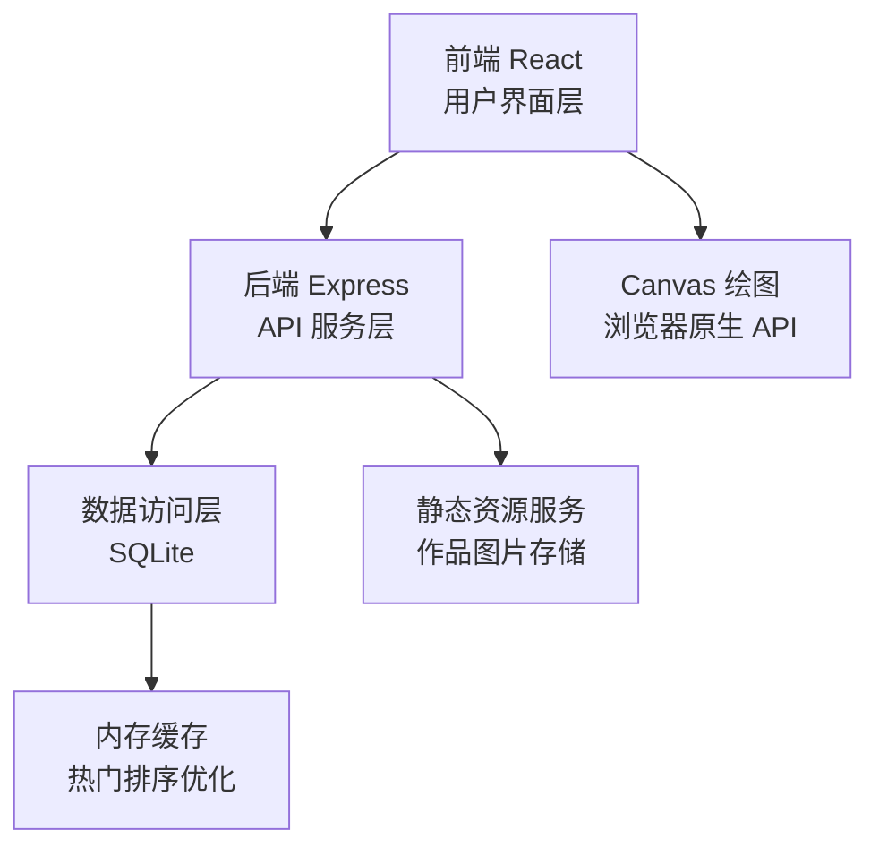
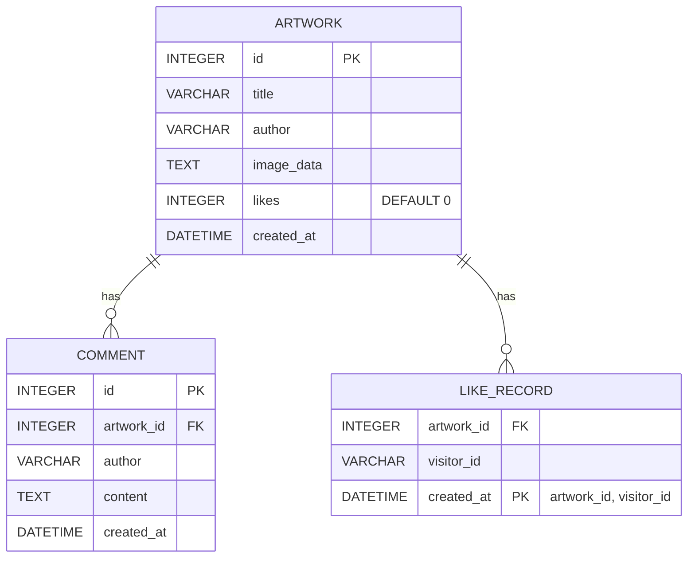

## 1. 架构设计

本项目采用前后端分离的全栈架构，前端使用 React 提供交互式用户界面，后端使用 Express 提供 RESTful API 服务，数据存储采用轻量级 SQLite 数据库。



## 2. 技术描述

- **前端框架**：React@18 + TypeScript + Vite
- **状态管理**：Zustand（轻量级状态管理）
- **路由管理**：React Router DOM@6
- **样式方案**：Tailwind CSS@3 + 自定义 CSS 变量
- **图标库**：Lucide React
- **后端框架**：Express@4 + TypeScript
- **数据库**：SQLite3 + better-sqlite3
- **数据存储**：本地文件系统（作品图片）
- **初始化工具**：vite-init（react-express-ts 模板）

## 3. 路由定义

| 路由路径 | 页面用途 |
|---------|---------|
| `/` | 公共画廊首页，展示作品列表 |
| `/create` | 涂鸦创作页，Canvas 绘图界面 |
| `/artwork/:id` | 作品详情页，展示大图和评论区 |

## 4. API 定义

### 4.1 TypeScript 类型定义

```typescript
// 作品实体
interface Artwork {
  id: number;
  title: string;
  author: string;
  imageData: string;
  likes: number;
  createdAt: number;
}

// 评论实体
interface Comment {
  id: number;
  artworkId: number;
  author: string;
  content: string;
  createdAt: number;
}

// 点赞记录
interface LikeRecord {
  artworkId: number;
  visitorId: string;
}
```

### 4.2 API 接口列表

| 方法 | 路径 | 说明 | 请求参数 | 响应格式 |
|------|------|------|----------|----------|
| GET | `/api/artworks` | 获取作品列表 | `sort: 'hot' \| 'latest'`, `limit?: number`, `offset?: number` | `{ data: Artwork[], total: number }` |
| GET | `/api/artworks/:id` | 获取单个作品详情 | 路径参数 `id` | `{ data: Artwork }` |
| POST | `/api/artworks` | 发布新作品 | `{ title: string, author: string, imageData: string }` | `{ data: Artwork, message: string }` |
| POST | `/api/artworks/:id/like` | 点赞作品 | 路径参数 `id`, Body: `{ visitorId: string }` | `{ data: { likes: number, liked: boolean } }` |
| GET | `/api/artworks/:id/comments` | 获取作品评论列表 | 路径参数 `id` | `{ data: Comment[] }` |
| POST | `/api/artworks/:id/comments` | 发表评论 | 路径参数 `id`, Body: `{ author: string, content: string }` | `{ data: Comment }` |

### 4.3 响应状态码

| 状态码 | 说明 |
|--------|------|
| 200 | 请求成功 |
| 201 | 资源创建成功 |
| 400 | 请求参数错误 |
| 404 | 资源不存在 |
| 500 | 服务器内部错误 |

## 5. 服务器架构图

```mermaid
graph TD
    A["客户端请求"] --> B["Express 中间件层<br/>CORS / 静态文件 / JSON 解析"]
    B --> C["路由层<br/>/api/artworks /api/comments"]
    C --> D["控制器层<br/>ArtworkController CommentController"]
    D --> E["服务层<br/>业务逻辑处理"]
    E --> F["数据访问层<br/>SQLite CRUD 操作"]
    F --> G["SQLite 数据库文件<br/>data/doodle.db"]
    H["文件系统<br/>public/uploads/"] <-- E
```

## 6. 数据模型

### 6.1 实体关系图



### 6.2 数据库 DDL

```sql
-- 作品表
CREATE TABLE IF NOT EXISTS artworks (
  id INTEGER PRIMARY KEY AUTOINCREMENT,
  title VARCHAR(255) NOT NULL,
  author VARCHAR(100) NOT NULL,
  image_data TEXT NOT NULL,
  likes INTEGER DEFAULT 0,
  created_at DATETIME DEFAULT CURRENT_TIMESTAMP
);

-- 评论表
CREATE TABLE IF NOT EXISTS comments (
  id INTEGER PRIMARY KEY AUTOINCREMENT,
  artwork_id INTEGER NOT NULL,
  author VARCHAR(100) NOT NULL,
  content TEXT NOT NULL,
  created_at DATETIME DEFAULT CURRENT_TIMESTAMP,
  FOREIGN KEY (artwork_id) REFERENCES artworks(id) ON DELETE CASCADE
);

-- 点赞记录表（防止重复点赞）
CREATE TABLE IF NOT EXISTS like_records (
  artwork_id INTEGER NOT NULL,
  visitor_id VARCHAR(100) NOT NULL,
  created_at DATETIME DEFAULT CURRENT_TIMESTAMP,
  PRIMARY KEY (artwork_id, visitor_id),
  FOREIGN KEY (artwork_id) REFERENCES artworks(id) ON DELETE CASCADE
);

-- 索引优化
CREATE INDEX IF NOT EXISTS idx_artworks_created ON artworks(created_at DESC);
CREATE INDEX IF NOT EXISTS idx_artworks_likes ON artworks(likes DESC);
CREATE INDEX IF NOT EXISTS idx_comments_artwork ON comments(artwork_id);
CREATE INDEX IF NOT EXISTS idx_like_records_visitor ON like_records(visitor_id);

-- 初始示例数据
INSERT INTO artworks (title, author, image_data, likes) VALUES 
('太阳与月亮', '小画家', 'data:image/png;base64,...', 42),
('可爱小猫', '涂鸦达人', 'data:image/png;base64,...', 28),
('彩虹桥', '创意无限', 'data:image/png;base64,...', 35);
```

### 6.3 项目目录结构

```
doodle-gallery/
├── src/                          # 前端代码
│   ├── components/               # 组件目录
│   │   ├── Canvas/DrawingCanvas.tsx    # 画布组件
│   │   ├── Canvas/Toolbar.tsx          # 工具栏组件
│   │   ├── Canvas/ColorPalette.tsx     # 调色盘组件
│   │   ├── Gallery/ArtworkCard.tsx     # 作品卡片
│   │   ├── Gallery/ArtworkGrid.tsx     # 作品网格
│   │   ├── Gallery/SortTabs.tsx        # 排序切换
│   │   ├── Detail/ArtworkDetail.tsx    # 作品详情
│   │   ├── Detail/CommentSection.tsx   # 评论区
│   │   ├── Detail/LikeButton.tsx       # 点赞按钮
│   │   ├── common/Header.tsx           # 顶部导航
│   │   └── common/PublishModal.tsx     # 发布弹窗
│   ├── pages/                    # 页面目录
│   │   ├── GalleryPage.tsx       # 画廊首页
│   │   ├── CreatePage.tsx        # 创作页
│   │   └── ArtworkDetailPage.tsx # 详情页
│   ├── hooks/                    # 自定义 Hooks
│   │   ├── useCanvas.ts          # Canvas 绘图逻辑
│   │   └── useVisitor.ts         # 访客身份管理
│   ├── store/                    # Zustand 状态
│   │   └── useArtworkStore.ts    # 作品状态管理
│   ├── utils/                    # 工具函数
│   │   ├── api.ts                # API 请求封装
│   │   └── canvas.ts             # Canvas 工具函数
│   ├── types/                    # 类型定义
│   │   └── index.ts
│   ├── App.tsx
│   ├── main.tsx
│   └── index.css
├── api/                          # 后端代码
│   ├── index.ts                  # Express 入口
│   ├── routes/                   # 路由
│   │   ├── artworks.ts
│   │   └── comments.ts
│   ├── controllers/              # 控制器
│   │   ├── ArtworkController.ts
│   │   └── CommentController.ts
│   ├── services/                 # 业务逻辑
│   │   ├── ArtworkService.ts
│   │   └── CommentService.ts
│   ├── db/                       # 数据访问
│   │   ├── index.ts              # 数据库连接
│   │   ├── migrations/           # 迁移脚本
│   │   └── seed.ts               # 种子数据
│   └── types/                    # 后端类型
├── public/                       # 静态资源
├── data/                         # 数据库文件目录
├── shared/                       # 共享类型
│   └── types.ts
├── vite.config.ts
├── tailwind.config.js
├── tsconfig.json
├── package.json
└── README.md
```
